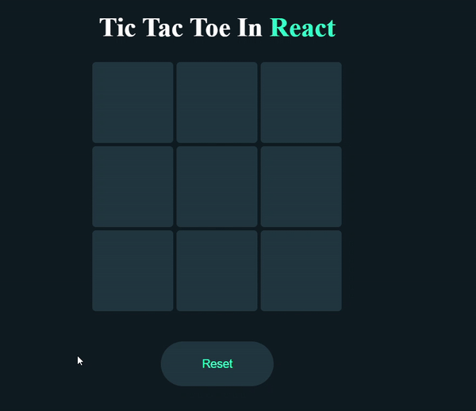

# Tic Tac Toe Game in React 🎮

A simple React Tic Tac Toe game where two players take turns marking their symbol in a 3x3 grid. The first player to get three of their symbols in a row wins the game!




## Features 🌟

- Classic Tic Tac Toe gameplay.
- Alternating turns between two players.
- Winning condition check for rows, columns, and diagonals.

## Usage

1. **Clone the repository:**

   ```bash
    git clone https://github.com/Eraycann/tic-tac-to

    Open the project folder:    cd tic-tac-toe
    Install dependencies:       npm install
    Run the application:        npm run dev (It is recommended to install vite for react)

The app will be accessible at http://localhost:3000.
Start answering questions and enjoy the quiz!


## Live Demo 🌐
   - Check out the live demo: [Quiz App Demo](https://tic-tac-toe-game-in-react-one.vercel.app) 

## Components
   - TicTacToe.jsx: The main component handling the game logic and rendering.
   - App.jsx: The root component containing the TicTacToe component

## Contributing 🤝
   - Contributions are welcome! Feel free to enhance the design, add new features, or fix any issues. Open a pull request to contribute.

## License 📜
   - This project is licensed under the MIT License.

## Author ✨
- Eraycan Sivri
- Contact: eraycansivri@hotmail.com
- GitHub: [GitHub Profile](https://github.com/Eraycann)

- Enjoy playing Tic Tac Toe! 🎉


